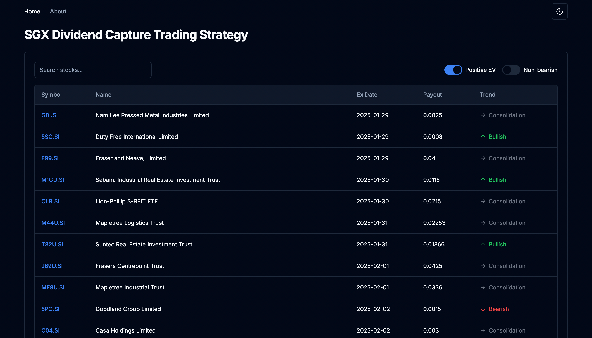

# Dividend Capture Strategy Tracker

## Overview

This web app provides tools for backtesting the [dividend capture strategy](https://www.investopedia.com/articles/stocks/11/dividend-capture-strategy.asp) on SGX equities, with your desired backtest duration and risk threshold, as you can customise the maximum number of days you are willing to hold. It also calculates for you the frequency in which the dividend capture strategy works on this particular stock over the past years, with the average profit and frequency in which the strategy is profitable.

The landing page also sorts all stocks by estimated upcoming dividend date, so that you can be prepared to execute the strategy on the correct tickers. The backend is implemented in Python.

This is something I've always wanted to build for my own personal use and finances, but the web app will be deployed soon so everyone can benefit off it as well!

If you use this web app, I am not liable for any financial decisions you make. Please do not try dividend capture in a bear market, as it is likely your capital loss will not be covered by the dividend payout.

## Feature List (Non-exhaustive)
1.	Main Dashboard:
	
    •	Displays all stocks listed on SGX.

	•	Sorts stocks by upcoming dividend payout dates or other metrics.
	
    •	Filters stocks by positive expected value (EV) for dividend capture strategy, or non-bearish stocks. (Strategy might not be profitable in bearish trends)

2.	Stock Details and Backtesting Page:
	
    •	Backtest tool that automatically backtests the stock based on past dividend payout data and price action.
	
    •	Displays key metrics, such as potential dates to buy and sell and historical EV for dividend capture strategy.
	
    •	Allows users to set a maximum holding period to suit your own risk appetite.
	
    •	Includes some technical indicators of the equity.

3.	Stop Loss and Target Calculator:
	
    •	Calculates and displays target prices and stop-loss levels based on a backend formula.
	
    •	Integrates with the backtest tool to recommend limit orders at a target and stop loss price.

4.	Trend Indicator:
	
    •	Displays a stock’s current trend as:
	
    •	Green: Bullish
	
    •	Red: Bearish
	
    •	Grey: Consolidation
	
    •	Trend calculations are handled by the backend and presented dynamically in the frontend, on both the dashboard and details pages.

5.	Data Automation:
	
    •	Automatically fetches and updates stock data daily.
	
    •	Backend script ensures real-time data accuracy.
	
    •	Non-urgent feature

6.	Strategy Success Rate:
	
    •	Displays the frequency (e.g., 86%) at which the dividend capture strategy is positive EV for each stock over a desired timeframe.
	
    •	Also displays the average profit using this strategy for this particular stock based on historical data.

## Future Improvements
	•	Deployment will happen as soon as the main features are done and linked to the front end, with data of all stocks in SGX.
	•	Expand to other stock exchanges, although more stable stock exchanges like SGX work better for the dividend capture strategy.
	•	Integrate technical analysis tools.
	•	Assimilate a database so that users can have their own accounts that has their trading history, preferred parameters (risk appetite), etc.

## License
This project is licensed under the MIT License.